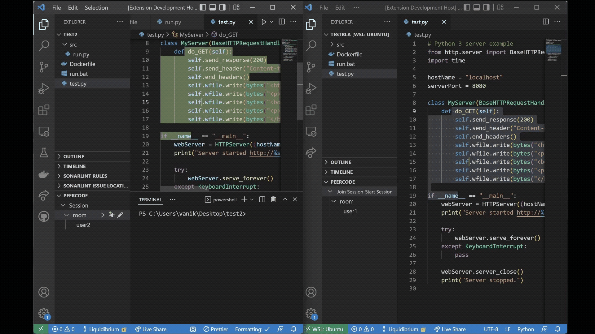
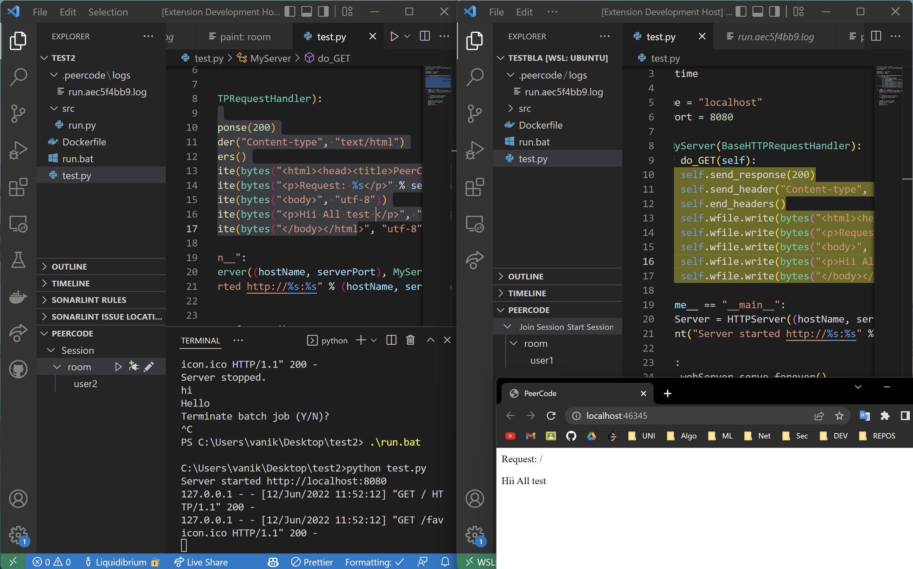
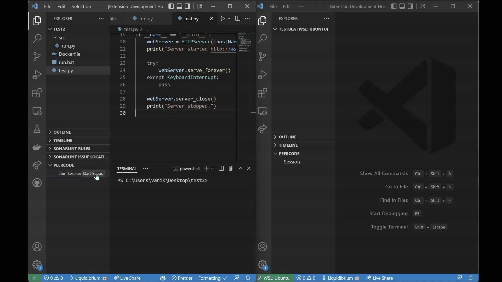

# PeerCode

Realtime Collaborative Code Editor extension for vscode

Extension is based on [CRDT`s](https://en.wikipedia.org/wiki/Conflict-free_replicated_data_type)
concrete implementation [YJS](https://github.com/yjs/yjs)
extension uses p2p via webRTC

## Features

* Share code with other peers
* Edit code in realtime
* Run code based on Dockerfile in project directory
* Share idead with collaborative paint
* Open ports for other peers and transfer date via p2p connection

create and join room:

Video:

https://raw.githubusercontent.com/PeerCodeProject/PeerCode/main/docs/peercode1.mp4

