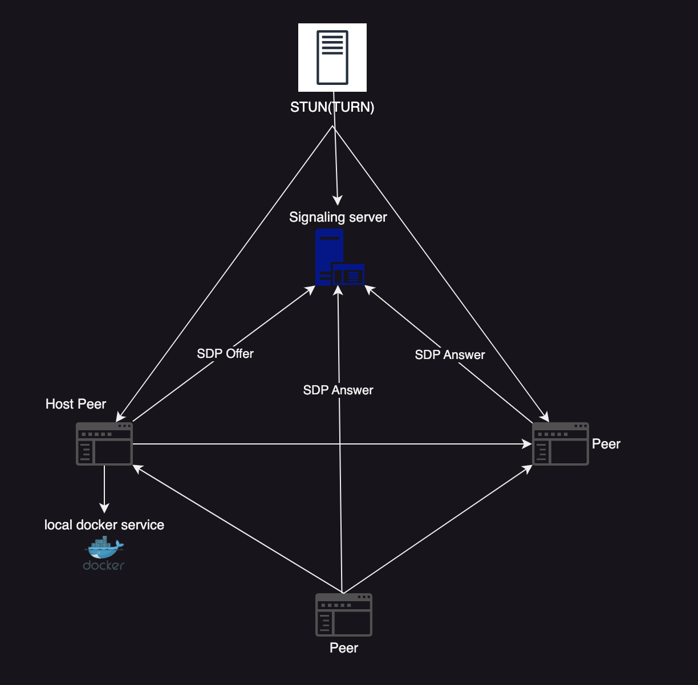

# PeerCode

Realtime Collaborative Code Editor extension for vscode

Extension is based on [CRDT`s](https://en.wikipedia.org/wiki/Conflict-free_replicated_data_type)
concrete implementation [YJS](https://github.com/yjs/yjs).

For peer to peer connection is used webRTC

## Features

* Share code with other peers
* Edit code in realtime
* Share ideas with collaborative paint
* Open ports for other peers and transfer data via p2p connection
* Share terminal with other peers
* Run code based on Dockerfile in project directory
  * if Dockerfile contains EXPOSE $PORT, then the port will be automatically shared with other peers

For better performance: Auto Save for changes should be on

create and join room:

## Architecture

## Video-demo

<https://raw.githubusercontent.com/PeerCodeProject/PeerCode/main/docs/peercode1.mp4>
